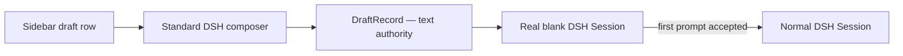

# dsh-draft-sessions

[](https://github.com/xarleyn/dsh-draft-sessions/actions/workflows/ci.yml)
[](https://www.npmjs.com/package/@yadsh/dsh-draft-sessions)
[](https://www.npmjs.com/package/@yadsh/dsh-draft-sessions)
[](package.json)
[](LICENSE)

Persistent, unsent future conversations for [DeepSeek Harness](https://github.com/deepseek-ai/deepseek-harness).

`dsh-draft-sessions` is building the Cursor-like workflow where you can prepare several independent tasks, leave them unsent, and return to each task later without starting an agent.

[Русский](README.ru.md) · [简体中文](README.zh-CN.md) · [Specification](SPEC.md) · [Architecture](docs/architecture.md) · [Roadmap](ROADMAP.md)

## See it in action

### With `@michengai/dsh-automation`

Automation provides the optional cooperative tab host. When it is installed and active, Draft Sessions detects `__dshNativeTabs@1` and inserts `Drafts` between `Tasks` and `Scheduled`. There is no hard dependency on Automation and no load-order requirement.

<p align="center">
  
</p>

<p align="center"><em>With Automation installed, unsent tasks live in their own Drafts tab while Tasks and Scheduled keep their existing views.</em></p>

### On stock DeepSeek Harness

Without Automation or another compatible tab host, the standard workspace and session browser stays unchanged. Draft Sessions adds a footer action instead; clicking it opens the same draft list in a popover.

<p align="center">
  
</p>

<p align="center"><em>The fallback uses the public sidebar footer slot and does not replace the stock workspace browser.</em></p>

### Draft actions

<p align="center">
  
</p>

<p align="center"><em>Create a distinct draft with <code>+</code>, then rename, duplicate, or delete it from the row menu.</em></p>

## Installation

Install the published npm package by name:

```bash
dsh plugin --profile web add @yadsh/dsh-draft-sessions
```

Or install the latest source directly from GitHub:

```bash
dsh plugin --profile web add github:xarleyn/dsh-draft-sessions
```

GitHub dependencies are built from source, so pnpm may ask you to approve this package's `prepare` script. The npm package is the recommended option when you do not want install-time build permission.

To remove the plugin:

```bash
dsh plugin --profile web remove @yadsh/dsh-draft-sessions
```

## The intended experience

The original goal was to reproduce Cursor's inline draft experience: unsent tasks and ordinary sessions living together in one workspace tree.

```text
my-project
├─ ● Fix auth middleware
├─ ◌ Add Grafana dashboards       Draft
├─ ◌ Refactor docker entrypoint   Draft
└─ ● Implement notifications
```

That exact layout could not be reproduced through DSH's current public sidebar APIs without replacing the stock workspace browser. Draft Sessions keeps the important behavior—independent unsent tasks, exact text restoration, and conversion on the first accepted prompt—but exposes drafts in a cooperative `Drafts` tab when one is available, or through the stock sidebar footer popover otherwise.

Each draft owns a real blank DSH Session, but its unsent text is stored separately on the Host. If that blank Session disappears after a restart, a new shell can be created and rebound without losing the task.



## What works now

- Host-backed JSON persistence under `$DSH_HOME/storages/dsh-draft-sessions/drafts.json`.
- Strict typed `draftSessions.list/create/update/delete/rebind` Remote methods.
- Independent workspace ordering and a configurable per-workspace limit.
- Optimistic revisions that reject stale browser writes.
- Atomic same-directory writes and strict durable-file validation.
- Distinct blank Session creation with the id persisted only after success.
- Missing Session detection and recovery rebinding without changing draft text.
- Accepted-Send observation with finalization only after `blank: false`.
- Rejected Send and blank slash-command preservation.
- Exact composer restore through the official per-session InputHub facade.
- Debounced optimistic autosave with a mandatory pre-switch flush.
- Draft creation from the Drafts `+` action or `Ctrl/Cmd + Shift + N`; both flush the active draft before opening a distinct one.
- A cooperative `Drafts` tab when the active sidebar host exposes `__dshNativeTabs@1`.
- A stock `sidebar.footer.action` trigger and popover when the tab protocol is absent.
- Portaled row menus, inline rename, duplicate, confirmed delete, keyboard navigation, and bounded drag reorder.
- Safe active-draft deletion with a final autosave flush and recovery after a rejected delete.
- Optional native-tab session filtering that hides draft shells without changing ordinary Sessions.
- No registration in the single-slot `sidebar.workspaces`; stock UI, Archive Manager, and other browser owners keep full control.
- Unit and DOM coverage for persistence, concurrency, lifecycle, composer, and sidebar behavior.

The current implementation deliberately does not send prompts, modify ordinary Session history, or delete blank Sessions.

## Requirements

- Node.js `^22.19.0` or `>=24.0.0`
- pnpm 11
- DeepSeek Harness `>=0.1.1-rc.2 <0.2.0` with the public `sidebar.footer.action` list slot

The published rc.2 client is supported without patches. Sidebar tab hosts are detected through the optional versioned `__dshNativeTabs@1` cooperation protocol; the plugin falls back to the stock footer action instead of replacing the workspace browser.

## Development

```bash
cd dsh-draft-sessions
pnpm install
pnpm check
```

Build and link the checkout into a Web profile:

```bash
pnpm build
dsh plugin --profile web add .
dsh --profile web --dump-config
```

## Releases

Releases are built from existing `v`-prefixed SemVer tags by the manual [Release workflow](.github/workflows/release.yml). The workflow checks out the exact tag, runs the full quality gate, replaces the package version with the tag version, creates an npm tarball and SHA-256 checksum, smoke-tests a clean tarball install, uploads the workflow artifact, and creates a GitHub Release with generated notes.

Maintainers can start it from **Actions → Release → Run workflow**, or with GitHub CLI:

```bash
git tag -a v0.1.0-rc.1 -m "v0.1.0-rc.1"
git push origin v0.1.0-rc.1
gh workflow run release.yml -f tag=v0.1.0-rc.1 -f publish_npm=false
```

Prerelease tags publish to the npm `next` dist-tag; stable tags use `latest`. npm publication is disabled by default. To enable the opt-in publish job:

1. Bootstrap the package on npm if it has not been published before.
2. Configure npm trusted publishing for this GitHub repository, workflow filename `release.yml`, environment `npm`, and the `npm publish` action.
3. Create the protected GitHub environment named `npm`, then run the workflow with `publish_npm=true`.

The publish job uses GitHub OIDC instead of a long-lived npm token. A GitHub Release is always created before npm publication is attempted.

## Configuration

The bundle inserts the `draft-sessions` Cordis row. Override it from the profile patch when needed:

```yaml
- id: draft-sessions
  config:
    # Blank uses $DSH_HOME/storages/dsh-draft-sessions/drafts.json
    storagePath: ""
    maxDraftsPerWorkspace: 50
```

## Current API

```ts
await ctx.remote.draftSessions.list({ workspaceId });

await ctx.draftSessionLifecycle.create({
  workspaceId,
  text: "",
});

await ctx.draftSessionLifecycle.ensureShell(draft);

await ctx.draftComposerBridge.open(draft);
await ctx.draftComposerBridge.flush();

await ctx.draftShortcutController.create(workspaceId);

await ctx.remote.draftSessions.update({
  id,
  expectedRevision: 4,
  text: "Add OTEL export",
});

await ctx.remote.draftSessions.rebind({
  id,
  expectedRevision: 5,
  sessionId: replacementSessionId,
});
```

The lifecycle service owns blank Session creation and recovery. The lower-level Remote methods remain available for storage operations; all mutations return the next `revision`, and a stale `expectedRevision` is rejected instead of silently overwriting another browser's edit.

## Design boundaries

- Draft text is authoritative in `DraftStore`; a blank Session is only an execution shell.
- Creating a draft must never make a model request.
- The first accepted prompt, not the Send button click, is the conversion boundary.
- Ordinary DSH Sessions remain owned entirely by DSH.
- Attachments are out of scope for v1; text and textual `@file` references come first.
- Draft rows compose beside the single workspace-browser occupant; the plugin never disables or embeds `ui-workspace`.
- Backing blank Sessions are excluded only from the workspace-browser slot, so the standard composer still receives the real current Session.

See [SPEC.md](SPEC.md) for acceptance criteria and [docs/architecture.md](docs/architecture.md) for the lifecycle.

## Contributing

Issues and focused pull requests are welcome. Please read [CONTRIBUTING.md](CONTRIBUTING.md) and run `pnpm check` before submitting a change.

## License

[MIT](LICENSE)
