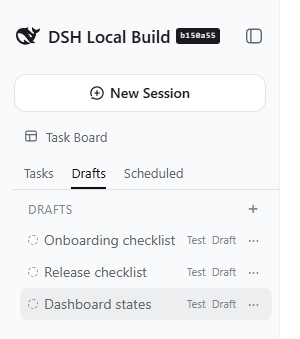
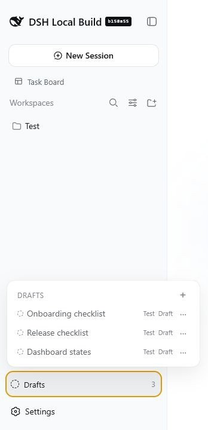
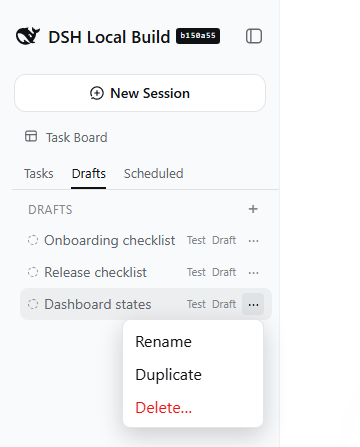
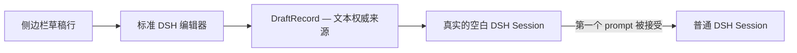

# dsh-draft-sessions

[](https://github.com/xarleyn/dsh-plugins/actions/workflows/ci.yml)
[](https://www.npmjs.com/package/@yadsh/dsh-draft-sessions)
[](https://www.npmjs.com/package/@yadsh/dsh-draft-sessions)
[](package.json)
[](LICENSE)

为 [DeepSeek Harness](https://github.com/deepseek-ai/deepseek-harness) 提供可持久保存、尚未发送的未来对话。

`dsh-draft-sessions` 致力于实现类似 Cursor 的工作流：你可以准备多个彼此独立的任务，暂时离开而不发送，并在之后回来继续编辑，而不会启动 agent。

[English](README.md) · [Русский](README.ru.md) · [规范](SPEC.md) · [架构](docs/architecture.md) · [路线图](ROADMAP.md)

## 效果展示

### 搭配 `@michengai/dsh-automation`

Automation 可作为可选的协作式标签页宿主。安装并启用后，Draft Sessions 会检测 `__dshNativeTabs@1`，并在 `Tasks` 与 `Scheduled` 之间插入 `Drafts`。Draft Sessions 不强制依赖 Automation，也不要求特定的加载顺序。

<p align="center">
  
</p>

<p align="center"><em>安装 Automation 后，未发送的任务会显示在独立的 Drafts 标签页中，Tasks 和 Scheduled 保持各自原有的视图。</em></p>

### 原生 DeepSeek Harness

如果没有 Automation 或其他兼容的标签页宿主，标准 workspace 和 session 浏览器不会改变。Draft Sessions 会在底部添加一个操作入口；点击后，同一个草稿列表会在浮层中打开。

<p align="center">
  
</p>

<p align="center"><em>该回退模式使用公开的侧边栏底部插槽，不会替换原生 workspace 浏览器。</em></p>

### 草稿操作

<p align="center">
  
</p>

<p align="center"><em>使用 <code>+</code> 创建独立草稿，然后通过行菜单重命名、复制或删除。</em></p>

## 安装

按名称安装已发布的 npm 包：

```bash
dsh plugin --profile web add @yadsh/dsh-draft-sessions
```

或者从本地 monorepo checkout 构建并安装：

```bash
pnpm --filter @yadsh/dsh-draft-sessions build
dsh plugin --profile web add ./plugins/dsh-draft-sessions
```

如果不需要修改源码，建议使用已发布的 npm 包。

卸载插件：

```bash
dsh plugin --profile web remove @yadsh/dsh-draft-sessions
```

## 预期体验

最初的目标是完整复现 Cursor 的行内草稿体验：未发送的任务与普通 session 一起显示在同一个 workspace 树中。

```text
my-project
├─ ● Fix auth middleware
├─ ◌ Add Grafana dashboards       Draft
├─ ◌ Refactor docker entrypoint   Draft
└─ ● Implement notifications
```

通过 DSH 当前公开的侧边栏 API，无法在不替换原生 workspace 浏览器的前提下完全复现这一布局。Draft Sessions 保留了最重要的行为——彼此独立的未发送任务、准确恢复文本，以及在第一个 prompt 被接受后转换为普通 Session——但会在可用时把草稿显示在协作式 `Drafts` 标签页中，否则通过原生侧边栏底部浮层显示。

每个草稿都拥有一个真实的空白 DSH Session，但未发送的文本会单独存储在 Host 上。如果该空白 Session 在重启后消失，插件可以创建新的外壳并重新绑定，而不会丢失任务文本。



## 当前功能

- 在 `$DSH_HOME/storages/dsh-draft-sessions/drafts.json` 中使用 Host 端 JSON 持久化。
- 严格类型化的 `draftSessions.list/create/update/delete/rebind` Remote 方法。
- 各 workspace 独立排序，并支持配置每个 workspace 的数量上限。
- 通过乐观 revision 拒绝来自其他浏览器的过期写入。
- 同目录原子写入，并严格校验持久化文件。
- 创建彼此独立的空白 Session，且仅在成功后保存其 id。
- 检测丢失的 Session，并在不改变草稿文本的情况下恢复绑定。
- 观察已接受的 Send，且仅在确认 `blank: false` 后完成草稿转换。
- Send 被拒绝或执行空白 slash 命令时保留草稿。
- 通过官方的 per-session InputHub facade 精确恢复编辑器内容。
- 带防抖的乐观自动保存，切换前强制 flush。
- 可通过 Drafts 中的 `+` 或 `Ctrl/Cmd + Shift + N` 创建草稿；两者都会先 flush 当前草稿，再打开一个新的独立草稿。
- 当活动侧边栏宿主公开 `__dshNativeTabs@1` 时，提供协作式 `Drafts` 标签页。
- 如果没有标签页协议，则提供原生 `sidebar.footer.action` 入口和浮层。
- 行菜单通过 portal 显示，并支持行内重命名、复制、确认删除、键盘导航和受限拖拽排序。
- 安全删除活动草稿：先完成最终自动保存，并在删除被拒绝时恢复。
- 可选的原生标签页 session 过滤，可隐藏草稿外壳而不改变普通 Session。
- 不注册到单插槽 `sidebar.workspaces`；原生 UI、Archive Manager 和其他浏览器所有者仍保留完整控制权。
- persistence、concurrency、lifecycle、composer 和 sidebar 均有单元测试与 DOM 测试覆盖。

当前实现不会主动发送 prompt、修改普通 Session 历史记录或删除空白 Session。

## 要求

- Node.js `^22.19.0` 或 `>=24.0.0`
- pnpm 10.4.1（开发环境）
- DeepSeek Harness `>=0.1.1-rc.2 <0.2.0`，并提供公开的 `sidebar.footer.action` 列表插槽

已发布的 rc.2 客户端无需补丁即可支持。侧边栏标签页宿主通过可选且带版本的 `__dshNativeTabs@1` 协作协议检测；如果没有该协议，插件会回退到原生底部入口，而不会替换 workspace 浏览器。

## 开发

在 monorepo 根目录运行：

```bash
pnpm install --frozen-lockfile
pnpm --filter @yadsh/dsh-draft-sessions check
```

构建项目并把当前 checkout 链接到 Web profile：

```bash
pnpm --filter @yadsh/dsh-draft-sessions build
dsh plugin --profile web add ./plugins/dsh-draft-sessions
dsh --profile web --dump-config
```

## 发布

该包使用 monorepo 的独立 Nx Version Plans。通过 `pnpm release:plan` 添加计划；维护者通过共享的[发布流程](../../docs/RELEASING.md)发布已验证的 tarball。

## 配置

bundle 会插入 `dsh-draft-sessions` Cordis 配置行。需要时可在 profile patch 中覆盖：

```yaml
- id: dsh-draft-sessions
  config:
    # 留空时使用 $DSH_HOME/storages/dsh-draft-sessions/drafts.json
    storagePath: ""
    maxDraftsPerWorkspace: 50
```

## 当前 API

```ts
await ctx.remote.draftSessions.list({ workspaceId });

await ctx.draftSessionLifecycle.create({
  workspaceId,
  text: "",
});

await ctx.draftSessionLifecycle.ensureShell(draft);

await ctx.draftComposerBridge.open(draft);
await ctx.draftComposerBridge.flush();

await ctx.draftShortcutController.create(workspaceId);

await ctx.remote.draftSessions.update({
  id,
  expectedRevision: 4,
  text: "Add OTEL export",
});

await ctx.remote.draftSessions.rebind({
  id,
  expectedRevision: 5,
  sessionId: replacementSessionId,
});
```

lifecycle 服务负责创建与恢复空白 Session 外壳。底层 Remote 方法仍可用于存储操作；所有 mutation 都会返回新的 `revision`，过期的 `expectedRevision` 会被拒绝，而不会静默覆盖另一个浏览器中的编辑。

## 设计边界

- `DraftStore` 中的草稿文本是权威来源；空白 Session 只是执行外壳。
- 创建草稿绝不能发起模型请求。
- 转换边界是第一个 prompt 被接受，而不是点击 Send 按钮。
- 普通 DSH Session 完全由 DSH 管理。
- 附件不在 v1 范围内；优先支持文本和文本形式的 `@file` 引用。
- 草稿行与单一 workspace-browser 占用者组合显示；插件不会禁用或嵌入 `ui-workspace`。
- 支撑草稿的空白 Session 只会从 workspace-browser 插槽中排除，因此标准编辑器仍会收到真实的当前 Session。

验收标准见 [SPEC.md](SPEC.md)，生命周期说明见 [docs/architecture.md](docs/architecture.md)。

## 贡献

欢迎提交 issue 和范围明确的 pull request。提交前请阅读 [CONTRIBUTING.md](CONTRIBUTING.md) 并运行 package check。

## 许可证

[MIT](LICENSE)。这是一个独立的社区项目，与 DeepSeek 无隶属关系，也未获得其官方认可。
